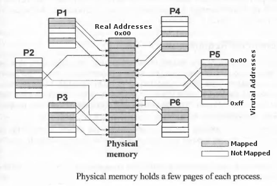
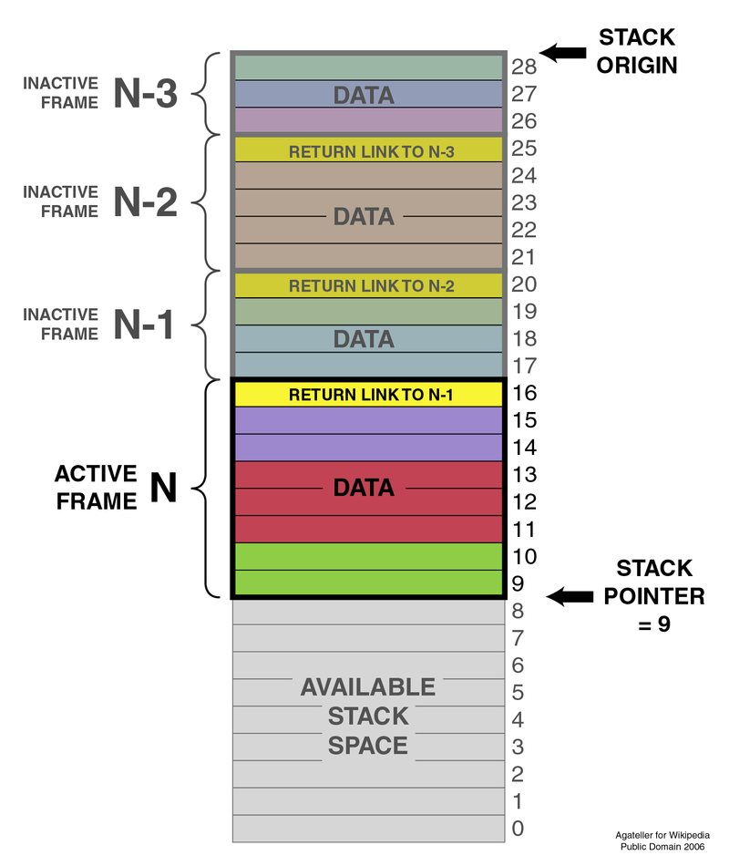

# Where goes my Stuff ?!

In the previous section we learned about functions and recursion. Before we
advance with C programming, I'd like to tell you about how a program deals with
memory. You will later do some memory management yourself, but for now we'll
take short peek behind the scenes.

## Virtualized Memory

A modern operating system abstracts away the *real* (physical) memory from a
running program (process). Each program sees only his own memory image. This
happens because memory used by each program is *virtualized* by the operation
system. Programs are isolated from each other.

Later, when talking about *pointers* we'll learn how to address certain
locations in memory. All addresses we encounter are virtual, specific to the
currently running program, and are translated by your operating system
(together with the memory management unit MMU) to physical memory addresses.
Ideally this is completely transparent, meaning you won't even notice until you
start looking for it.

While each byte in memory can be addressed, not every byte gets a *mapping*
from physical memory to virtual memory. Physical memory is divided into evenly
sized chunks (pages) and each page can then be mapped as a whole to a certain
program. This makes memory management and the translation process much easier.

  

Above figure (modified, original from [1]) shows an example of physical memory
divided into pages. Multiple programs (processes) P1--P6 have some pages mapped
to their virtual memory. A program can store data only inside these areas,
accessing unmapped memory is not allowed.

[1]: Unix Internals by Uresh Vahalia

## Memory Sections

### `.text`

When you compile a program from source, you receive a *runable* binary. This
binary contains the compiled code, data and a few other things. Upon running
this binary (aka starting the program) a part of your operating system (the
loader) loads relevant parts of that binary file into memory.

The section containing the compiled code, is referred to as the `.text`
section. It contains the instructions which will be executed by your system.

### Stack

This one is a little more complicated --- the stack is a data structure used to
properly call and return from functions. It is located in memory and consists
of a sequence of so-called *stack frames*. Each stack frame corresponds to a
function call and contains argument values, local variables together with some
bookkeeping (saved return address, saved base pointer).

Stack frames are put on top of each other (hence the name *stack*) for each
consecutive call. One could say *a new frame is pushed onto the stack*. When a
function returns the stack frame is removed from the top of the stack. Also
known as *popping a frame of the stack*.

Following figure illustrates a stack with multiple frames:

  

You may already be asking, but what happens when there is no memory for
additional stack frames since we used up all of it. Well, your program simply
crashes --- this is known as a *stack overflow*.

This should show you that calling functions, and especially recursion does not
come for free. Depending on the complexity of your function, this overhead
might be quite big.

### Data

Now that we know where our local variables are stored (for each function call),
we can talk about global variables. Global variables, as well as constants,
have their own little section in memory. I recommend avoiding global variables
whenever possible.

### Heap

Data and `.text` usually do not change over the runtime of a program, you may
updated a global variable's value, but you do not add or remove one.

When you don't know how much data will be needed at compile-time (statically)
you have the option to request (*allocate*) the required amount at runtime
(dynamically) from the operating system. You are in charge of the memory chunk
hand over to you by the operating system (together with what the standard
library provides). Nevertheless dynamically allocated memory lives inside the
*heap* section of your virtual memory image.

### Misc.

There are some other important sections, but we don't deal with them now. Maybe
more about them in the operating systems lecture.
