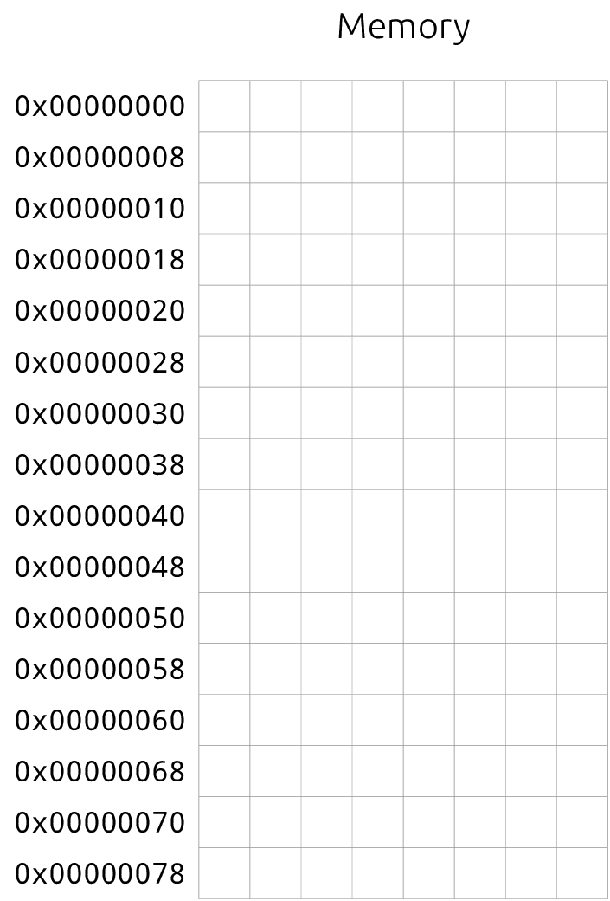
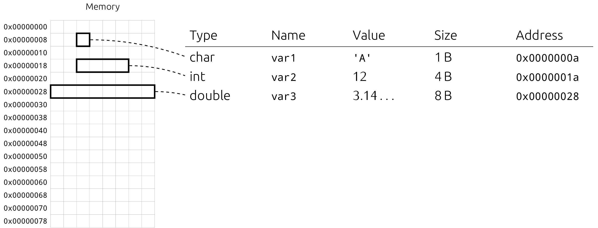
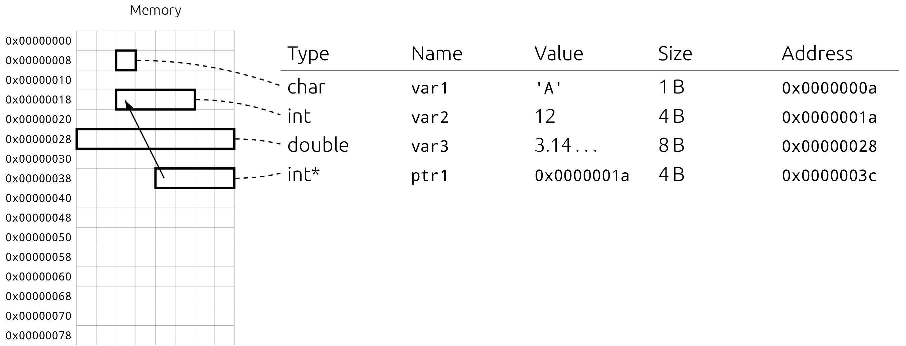
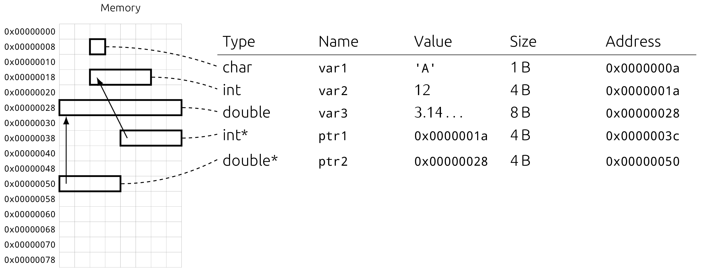
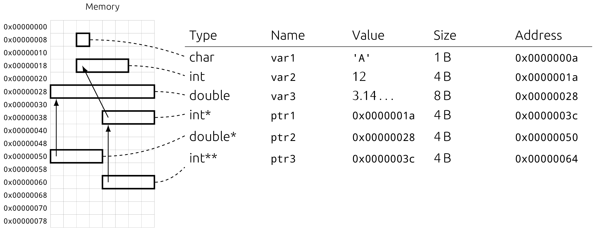
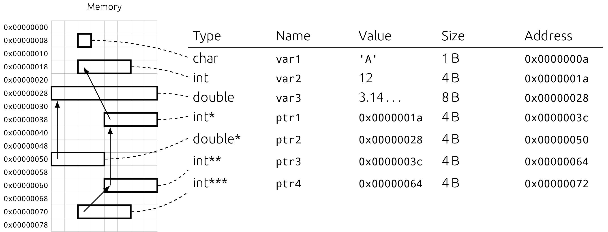

# WTF is a Pointer

This section will describe what pointers are, what can be done with them and so
on and so forth. In section `07` we learned that variables occupy space in
memory, we also learned about the different sections like the stack --- for
now, we don't care about sections and how exactly variables are organized in
memory.

## Addressing Memory

Let's first start with memory *addresses*. Take a look at the following
graphic, it displays the memory a program sees as a grid. Each *cell*
represents 1 byte and can be enumerated starting from the top left corner.

To help distinguish memory addresses from regular integers we write them as
hexadecimals (prefixed with `0x`) and with leading zeros. The upper bound of an
memory addresses is given by the architecture. 32 bit on x86 and 64 bit on
x86_64, but that's not important for now.



### Adding Variables to the Mix

Each variable has a type, holds a value and occupies space somewhere in memory.
The next image illustrates this by showing 3 variables and a table, filled with
mentioned information. Sizes, values and names are just example values, but the
concept should already look familiar.

The *address of a variable* is always the address of the first occupied cell.
Given this starting address and the size (which can be inferred from the type)
we can exactly determine the cells used for this variable.



### Our First Pointer

Now, equipped with this knowledge, imagine a variable which value is not an
integer or a float, but a *memory address*. Similar to all other variables it
has a type, a name, a value and needs to be stored somewhere in memory. Here we
call this variable `ptr1` and its value is the *address* of `var2`.

As displayed by the image below, the variable `ptr1` *points to* `var2`,
therefore this is called a *pointer*. Even further because `ptr1` points to an
`int`, it is a *pointer to `int`*, written as `int*`. Here we assume that
addresses are 32 bit (4 byte), hence our pointer occupies 4 byte of memory.



### The Second Pointer

Pointers aren't so complicated after all, huh? So let's do one more, this time
we let it point to the start of `var3` which is of type `double`, hence our new
pointer `ptr2` will be of type `double*`. Note that both `ptr1` and `ptr2` have
exactly the same size in memory even though they point to variables of
different size.



### Pointer to Pointer

Going further, there is nothing special about having a pointer point to another
pointer. `ptr3`'s value is just the memory address of `ptr1`. Its type is a
*pointer to pointer to `int`*, written as `int**`.



This can be done multiple times as the last figure shows with `ptr4` being a
*pointer to pointer to pointer to `int`* or `int***`.



## The `NULL` pointer

In our little example we did not care about memory sections and how exactly
variables are organized. In reality they are organized in a pretty strict
fashion by the compiler and runtime / operating system. Because of this a
variable will not be placed at the address `0x00000000`. Instead this value can
be used as a *sentinel* value carrying some deeper meaning and is also defined
in C as `NULL`.

A `NULL` pointer usually indicates the absence of a value, or failure of an
operation. You'll see this in more detail later on.

## Constructing a pointer

Getting a pointer to a variable is pretty easy, there is the *address operator*
`&` which returns you the address of a variable.

```c
int var1 = 42;
int* ptr_to_var1 = &var1;

/* You cannot use the address operator on a literal since it is not a variable
 * stored in memory. This will result in a compile error. */
int* ptr_to_42 = &42;
```

## Using a pointer

All this talk about pointers and constructing them would be useless if one
could not easily get the value pointed to. This operation is called
*dereferencing* a pointer and can be done with the operator `*`. Even further
this operator can be used on the left hand side of an assignment. Note the
similarity between this operator and the type of a pointer.

Next example shows how a swap function can be realized using pointers.

```c
#include <stdio.h>
#include <stdlib.h>

/* Swap takes two pointers to int and swaps the values pointed to. */
void swap(int* x, int* y) {

    /* first we get the value pointed to by `x` and store it inside `tmp` */
    int tmp = *x;

    /* next we get the value pointed to by `y` and store it at the location
     * pointed to by `x` */
    *x = *y;

    /* finally we write the saved value to the location pointed to by `y` */
    *y = tmp;
}

int main(void) {
    int a = 2;
    int b = 3;

    /* swap takes addreses, so we use `&` to get the address of a variable */
    swap(&a, &b);

    printf("a = %d, b = %d\n", a, b);

    return EXIT_SUCCESS;
}
```

Without pointers a swap function would not be possible since everything in C is
call-by-value. The mechanism we just created is referred to as
call-by-reference since we call `swap` with *references* (another term for
pointer) to our variables.

That's it for this section of the tutorial, next we'll talk about *pointer
arithmetic* which will be our introduction to arrays.
